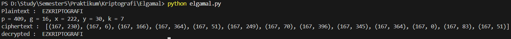

# ElGamal

## 📌 Deskripsi
Program ini merupakan implementasi algoritma **ElGamal** menggunakan bahasa pemrograman Python.  
ElGamal adalah algoritma kriptografi berbasis **asymmetric key** (kunci publik & privat) yang memanfaatkan konsep **logaritma diskret**.  
Program ini dapat melakukan proses **enkripsi** dan **dekripsi** terhadap pesan sederhana.

---

## ⚙️ Alur Program
1. **Parameter Awal**
   - `p` → bilangan prima (digunakan sebagai modulus).
   - `g` → generator (basis untuk perhitungan eksponensial).
   - `x` → private key (rahasia).
   - `y = g^x mod p` → public key yang dipublikasikan.

2. **Proses Enkripsi**
   - Input: plaintext (dalam bentuk angka) dan public key `(p, g, y)`.
   - Pilih bilangan acak `k` (1 < k < p-1).
   - Hitung:
     ```
     c1 = g^k mod p
     c2 = (m * y^k) mod p
     ```
   - Ciphertext hasil enkripsi: `(c1, c2)`.

3. **Proses Dekripsi**
   - Input: ciphertext `(c1, c2)` dan private key `x`.
   - Hitung shared key:
     ```
     c1^x = (c1)^x mod p
     ```
   - Cari **modular inverse** dari `c1^x` terhadap `p` → `c1^x_inv`.
   - Dekripsi pesan:
     ```
     m = (c2 * c1^x_inv) mod p
     ```

4. **Program Utama**
   - Mendefinisikan parameter `p`, `g`, `x`.
   - Menghitung public key `y`.
   - Mengenkripsi plaintext → menghasilkan ciphertext `(c1, c2)`.
   - Mendekripsi ciphertext → menghasilkan kembali plaintext asli.

---

## ▶️ Contoh Output

