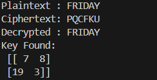

# Hill Cipher Implementation

Program ini mengimplementasikan algoritma **Hill Cipher** untuk proses enkripsi, dekripsi, dan pencarian matriks kunci. Algoritma Hill Cipher bekerja dengan menggunakan operasi aljabar linear pada matriks dalam aritmetika modulo 26 (sesuai jumlah huruf alfabet A–Z).

---

## Alur Program

1. **Konversi Teks ↔ Angka**
   - Huruf A–Z dikonversi menjadi angka 0–25 (`A=0, B=1, …, Z=25`).
   - Teks diubah ke bentuk numerik untuk diproses dalam matriks.
   - Hasil numerik dikonversi kembali menjadi teks setelah enkripsi/dekripsi.

2. **Enkripsi**
   - Plaintext diubah ke bentuk angka.
   - Jika panjang plaintext tidak habis dibagi ukuran matriks kunci `n`, maka ditambahkan padding huruf `X`.
   - Plaintext diproses per blok sepanjang `n` huruf.
   - Setiap blok dihitung dengan rumus:
     \[
     C = M_k \times P \pmod{26}
     \]
     - `M_k` = matriks kunci
     - `P` = blok plaintext
   - Hasil berupa ciphertext.

3. **Dekripsi**
   - Ciphertext diubah ke angka.
   - Dicari invers matriks kunci modulo 26.
   - Setiap blok ciphertext dihitung dengan rumus:
     \[
     P = M_k^{-1} \times C \pmod{26}
     \]
   - Hasil berupa plaintext.

4. **Pencarian Kunci**
   - Mengambil blok persegi pertama dari plaintext dan ciphertext sepanjang `n × n`.
   - Matriks plaintext (`M_p`) dan ciphertext (`M_c`) dibentuk.
   - Dicari invers dari `M_p` modulo 26.
   - Matriks kunci dihitung dengan rumus:
     \[
     M_k = M_c \times M_p^{-1} \pmod{26}
     \]

5. **Invers Matriks Modulo 26**
   - Hitung determinan matriks, lalu cari invers determinan mod 26.
   - Hitung matriks kofaktor → adjugate.
   - Matriks invers = `det_inv × adjugate (mod 26)`.
   - Jika determinan tidak memiliki invers mod 26, maka matriks tidak valid.

6. **Hasil Running**

---
