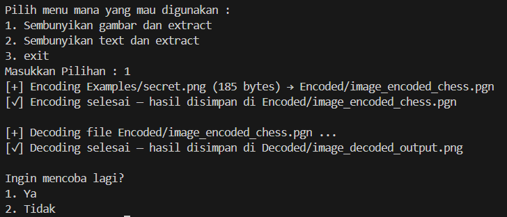
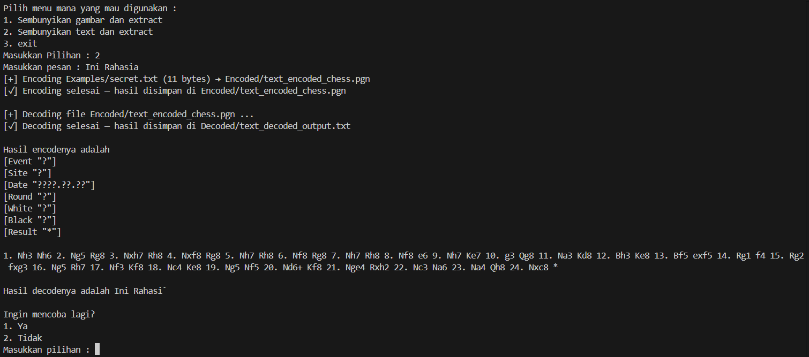

# ♟️ Chess Steganography Encoder/Decoder

Program ini merupakan implementasi **steganografi berbasis permainan catur (PGN)**.  
Data seperti **teks** atau **gambar** disembunyikan ke dalam urutan langkah-langkah permainan catur, lalu bisa diekstraksi kembali menjadi file aslinya.

---

## ⚙️ Fitur Utama

- 🔒 **Encoding (penyembunyian data)**
  - Menyembunyikan file teks (`.txt`) atau gambar (`.png`) ke dalam file permainan catur (`.pgn`).
- 🔓 **Decoding (ekstraksi data)**
  - Mengembalikan file asli dari file `.pgn`.
- 🧠 **Otomatis membuat file contoh**
  - Jika `secret.txt` atau `secret.png` belum ada, program otomatis membuatnya.
- 💻 **Antarmuka interaktif di terminal**
  - Pengguna dapat memilih mode teks atau gambar melalui menu sederhana.

---

## 🧱 Struktur Folder

├── Examples/
│ ├── secret.txt
│ └── secret.png
│
├── Encoded/
│ ├── text_encoded_chess.pgn
│ └── image_encoded_chess.pgn
│
├── Decoded/
│ ├── text_decoded_output.txt
│ └── image_decoded_output.png
│
├── Hasil_Run/
│ └── image.png
│
└── main.py

---

## 🚀 Cara Menjalankan Program

### 1️⃣ Install Dependensi

Program ini membutuhkan dua library:
- `python-chess` → untuk manipulasi permainan catur
- `Pillow` → untuk membuat file gambar contoh

Jalankan perintah berikut:

```bash
pip install python-chess pillow
```

### 2️⃣ Jalankan Program
python main.py

Lalu pilih menu yang muncul:

Pilih menu mana yang mau digunakan :
1. Sembunyikan gambar dan extract
2. Sembunyikan text dan extract
3. exit

### 🧠 Penjelasan Cara Kerja
🔹 Encoding (encode())
1. File input (teks/gambar) dibaca dalam bentuk byte.
2. Program membuat header yang berisi:
    - Panjang file (8 byte)
    - Panjang ekstensi (1 byte    )
    - Ekstensi file itu sendiri
3. Semua data (header + isi file) diubah menjadi bitstream.
4. Setiap potongan bit diterjemahkan menjadi langkah catur berdasarkan jumlah legal moves yang tersedia.
5. Jika permainan berakhir, game baru dibuat hingga seluruh bit tertanam.
6. Hasilnya disimpan sebagai file .pgn.

🔹 Decoding (decode())
1. File .pgn dibaca ulang menjadi urutan langkah.
2. Setiap langkah dikonversi kembali menjadi nilai bit.
3. Program membaca header untuk menentukan panjang file dan ekstensi.
4. Sisa bitstream dikonversi kembali ke bentuk asli (file teks/gambar).
5. Hasilnya disimpan ke folder Decoded/.

### 🧪 Hasil Running




### 🧑‍💻 Pembuat
Raymond Frans Dodi Situmorang
Fakultas Matematika dan Ilmu Pengetahuan Alam
Universitas Padjadjaran (Unpad)