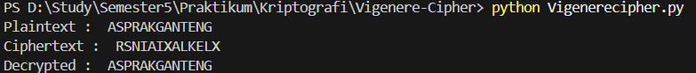

# Vigenere Cipher

## 📌 Deskripsi
Program ini merupakan implementasi algoritma **Vigenere Cipher** menggunakan bahasa pemrograman Python.  
Vigenere Cipher adalah salah satu algoritma kriptografi klasik yang menggunakan **kunci berupa kata** untuk melakukan enkripsi dan dekripsi pesan.

---

## ⚙️ Alur Program
1. **Konversi Karakter ke Angka**  
   - Fungsi `char_to_num(c)` mengubah huruf menjadi angka (A=0, B=1, ..., Z=25).  
   - Fungsi `num_to_char(n)` mengubah angka kembali menjadi huruf.

2. **Proses Enkripsi (`encrypt`)**  
   - Input: plaintext dan key.  
   - Spasi dihapus dari plaintext.  
   - Setiap huruf plaintext diubah ke angka (`pi`).  
   - Setiap huruf kunci diubah ke angka (`ki`).  
   - Rumus enkripsi:  
     ```
     Ci = (Pi + Ki) mod 26
     ```
   - Hasil (`ci`) dikonversi kembali menjadi huruf untuk membentuk ciphertext.

3. **Proses Dekripsi (`decrypt`)**  
   - Input: ciphertext dan key.  
   - Setiap huruf ciphertext diubah ke angka (`ci`).  
   - Setiap huruf kunci diubah ke angka (`ki`).  
   - Rumus dekripsi:  
     ```
     Pi = (Ci - Ki) mod 26
     ```
   - Hasil (`pi`) dikonversi kembali menjadi huruf untuk membentuk plaintext asli.

4. **Program Utama**  
   - Mendefinisikan plaintext: `"ASPRAKGANTENG"`.  
   - Mendefinisikan key: `"RAY"`.  
   - Melakukan enkripsi → menghasilkan ciphertext.  
   - Melakukan dekripsi → menghasilkan kembali plaintext asli.  

---

## ▶️ Contoh Output

